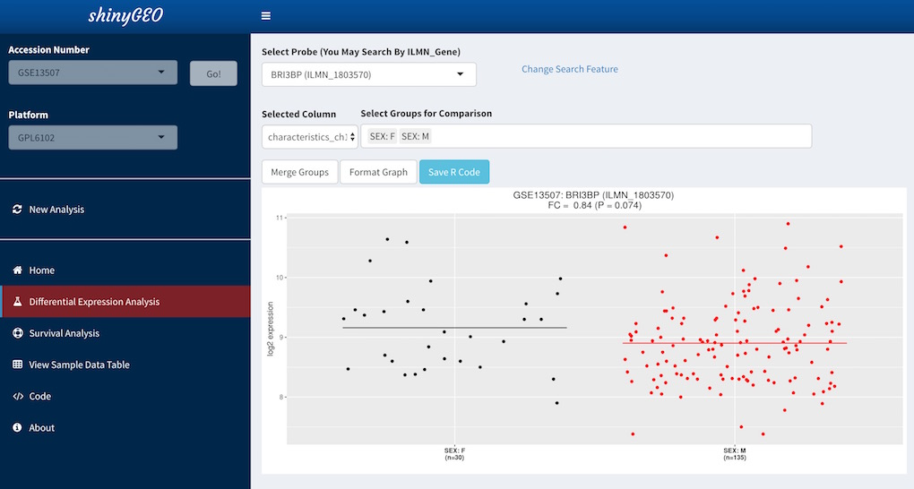
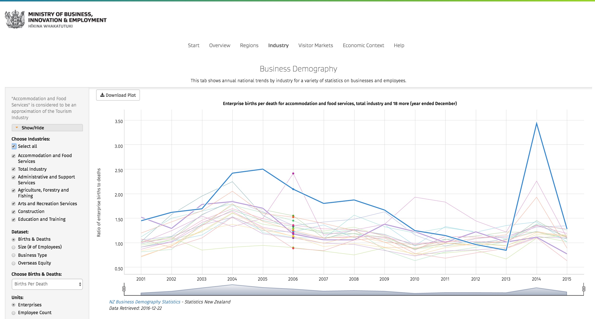
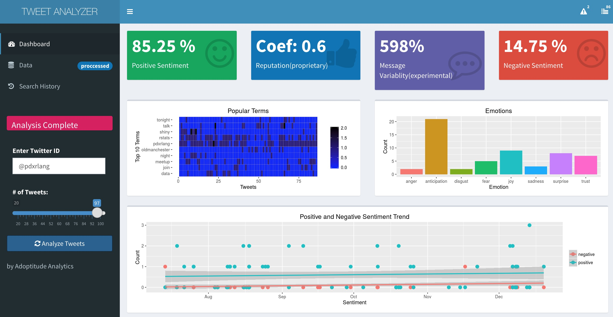
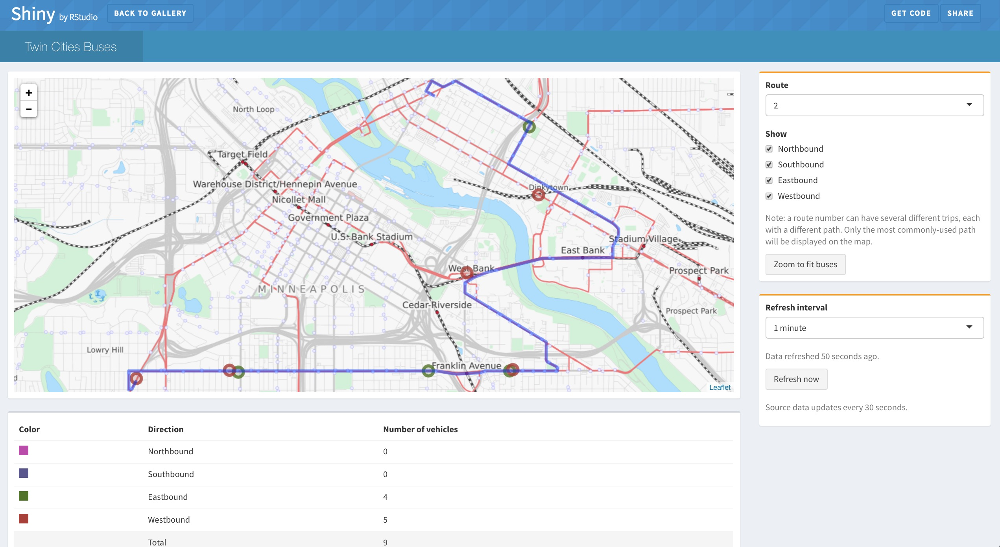
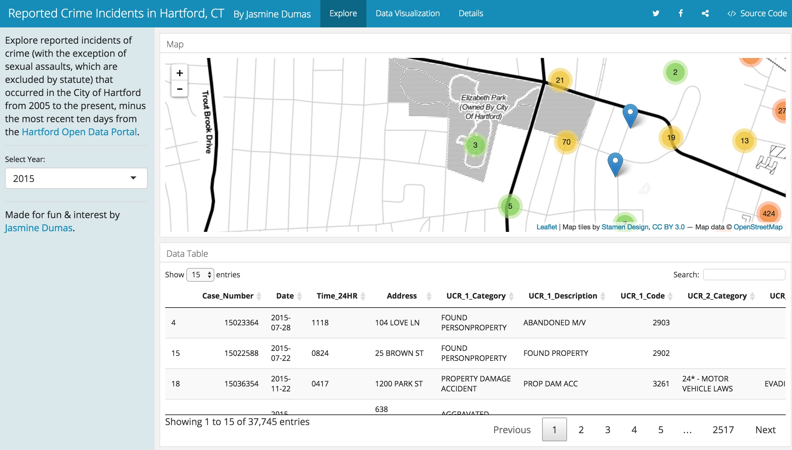
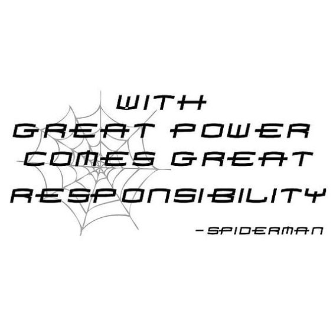
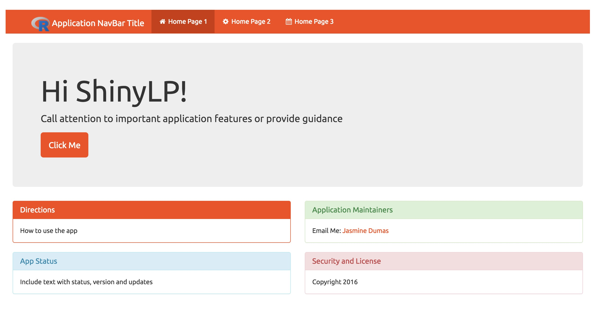
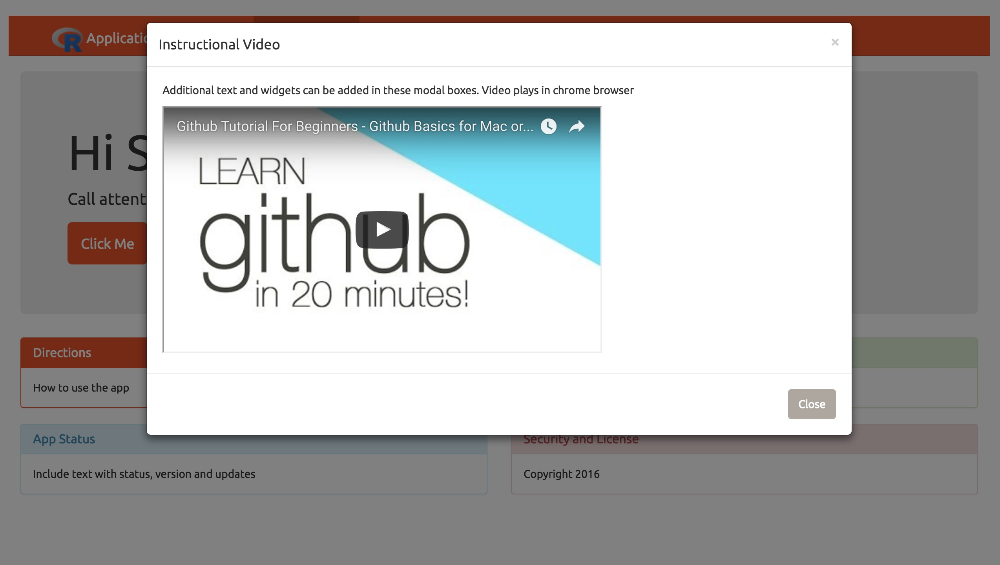
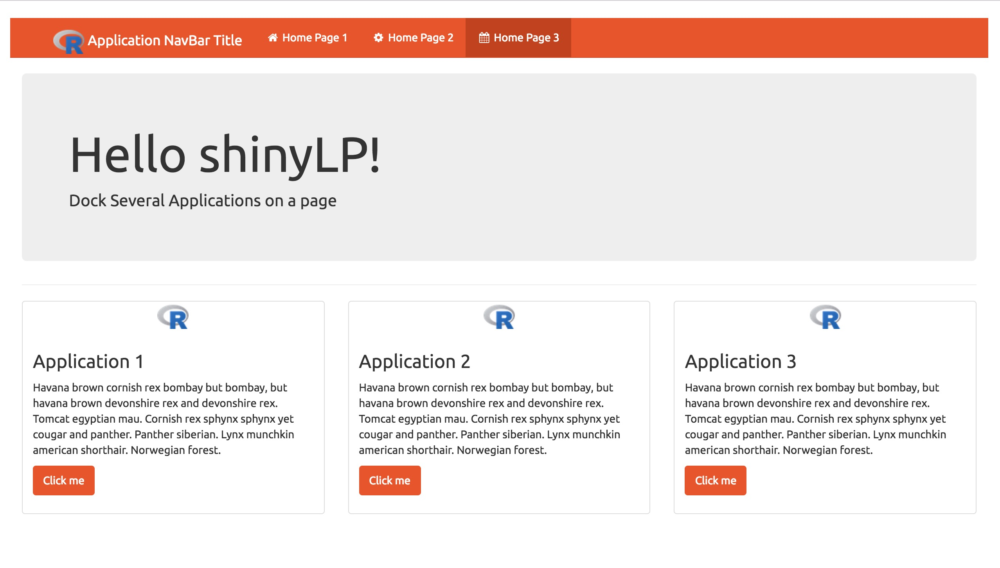

```{r setup, include=FALSE}
knitr::opts_chunk$set(echo = TRUE)
```

## Hi Portland!
- I'm Jasmine Dumas
    - **Data Scientist** and **useR** living in Connecticut
    - Work at **Simple Finance** based in PDX
- Slides and Materials available on GitHub: 
    - [jasdumas/talks/PDX-R-user-group](https://github.com/jasdumas/talks/tree/master/PDX-R-user-group)

</img>

## Why should you care about this work?

- Shiny is a popular tool and is gaining popularity
- Advanced features have been added to shiny which have led to more robust apps
- With the creation of robust and advanced apps we run the risk of not including critical user experience (UX) & design features 
    - Those features help direct users **how** to use the app as intended
    - Especially if the apps are developed for non-technical users
</img>    
    
## I began buildng shiny apps in 2014...

- Identification of cancer bio-markers based on gene expression data
- Development of a pipeline that would automate the analysis of gene expression datasets from the [Gene Expression Omnibus](http://www.ncbi.nlm.nih.gov/geo/)
- Focused on creating a user friendly tool
    - Understand how non-R users would interpret features, visualizations, and statistical inference



## So building shiny apps are cool because...

* Transforms static R code into interactive reports and dashboards
* No need to learn web development skills
* free or low cost hosting options for [shinyapps.io](https://www.rstudio.com/products/shinyapps/) & [shiny server](https://www.rstudio.com/products/shiny-server-pro/)
* Shiny is extendable and modular

## Here are some cool advanced features of shiny add-on packages

- [`shinyjs`](https://github.com/daattali/shinyjs): lets you perform common useful JavaScript operations in Shiny apps that will greatly improve your apps without having to know any JavaScript.
- [`shinydashboard`](https://rstudio.github.io/shinydashboard/): provides a theme on top of Shiny, making it easy to create attractive dashboards.  
- [`shinythemes`](https://rstudio.github.io/shinythemes/): easily alter the overall appearance of your Shiny application.
- [`shinyBS`](https://ebailey78.github.io/shinyBS/): Adds additional Twitter Bootstrap components to Shiny.
    - **Bootstrap** is the most popular HTML, CSS, and JS framework for developing responsive, mobile first projects on the web.

## 
<h1 position="center" align="absolute" style="color:#8A2BE2;"> Cool shiny examples from the internet! </h1>

## [New Zealand Tourism website](https://mbienz.shinyapps.io/tourism_dashboard_prod/) 



## [Tweet analyzer](http://socialdash.adoptitude.com/)



## [Twin Cities Bus](https://shiny.rstudio.com/gallery/bus-dashboard.html)



## [Hartford Connecticut Crime](https://jasminedumas.shinyapps.io/hartford-crime/#explore)



## A quote from an influential R Programmer...



## Here is the point...

<h1 position="center" align="absolute" style="color:#8A2BE2;"> We, as shiny developers need to <b>prioritze user experience</b> now that apps are getting more advanced and the user base is expanding! </h1>


## There are ways to do that...

- Take a nod from existing web applications and provide informative landing pages which detail usage, examples, status, developer contact information...all the pieces to ensure that users are set up for success
- User success can be defined if they:
    - Can use the application as intended
    - Can contact developers for assistance
    - Can see examples
</img> 


## This is where `shinyLP` comes in...

- A R package for adding *even more* **Bootstrap** components to make landing home pages for Shiny 
- On CRAN and GitHub
[](http://cran.rstudio.com/web/packages/shinyLP/index.html)

```{r}
jumbotron <- function(header , content, button = TRUE,  ...){

  button_label = c(...)

  if (button){
    HTML(paste0("<div class='jumbotron'>
                <h1> ", header, "</h1>
                <p>", content ,"</p>",
                "<p><a class='btn btn-primary btn-lg' button id='tabBut'>", button_label, "</a></p>
                </div>") )

  } else {
    HTML(paste0("<div class='jumbotron'>
                <h1> ", header, "</h1>
                <p>", content ,"</p>",
                "</div>") )
  }

}
```

## Orange you glad I'm showing examples of `shinyLP`...
<hr>


## This `shinyLP` example is a-peeling...
<hr>


## Naval oranges prevent scurvy...
<hr>


## The End

- Questions & Discussion!


