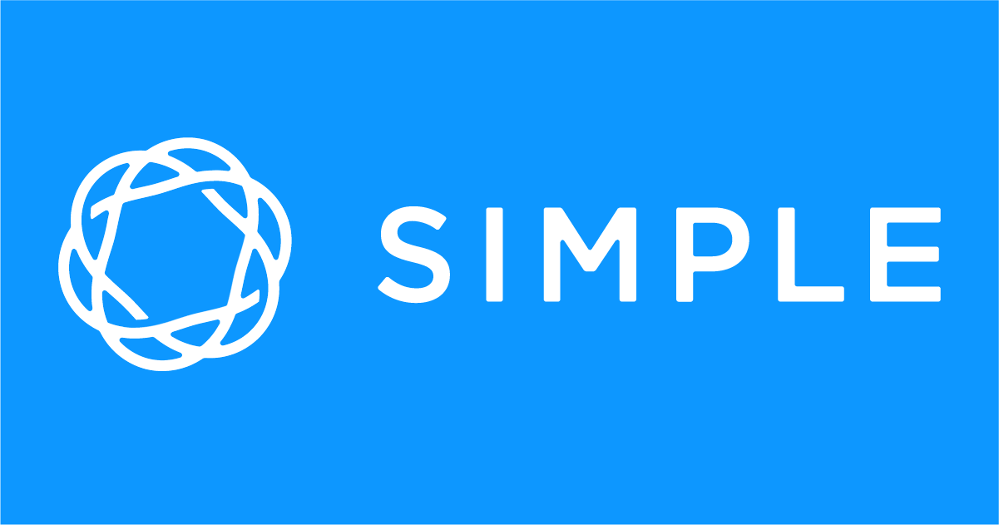

```{r setup, include=FALSE}
knitr::opts_chunk$set(echo = TRUE)
```

## Hi Portland!
- I'm Jasmine Dumas
    - **Data Scientist** and **useR** living in Connecticut
    - Work at **Simple Finance** based in Portland, OR
    - Author of **`ttbbeer`** and **`shinyLP`**
- Slides and Materials available on GitHub: 
    - [jasdumas/talks/PDX-R-user-group](https://github.com/jasdumas/talks/tree/master/PDX-R-user-group)

</img>



## A quick refresher of `shiny` before we get started! 
- Transforms static R code into interactive reports and dashboards
- No need to learn web development languages 
    - CSS, HTML, JavaScript, JQuery
- free or low cost hosting options for [shinyapps.io](https://www.rstudio.com/products/shinyapps/) & [shiny server](https://www.rstudio.com/products/shiny-server-pro/)
- Shiny is extendable and modular

</img>


## I began buildng `shiny` apps in 2014

- Focused on creating a [user friendly tool](http://gdancik.github.io/shinyGEO/) for biologists to analyze gene expression data
    - Worked towards understanding how non-R users would utilize the app


## Why should you care about this?

- `shiny` apps are becoming more advanced and if we don't incorporate user experience (UX) features, users may have difficulty using the app as intended
    - Especially non-technical users
    
</img>   

## What could go wrong when we don't include user experience features?


## Additional `shiny` add-on packages that increase usability

- [`shinyjs`](https://github.com/daattali/shinyjs): Adds JavaScript operations
- [`shinydashboard`](https://rstudio.github.io/shinydashboard/): Create dashboards  
- [`shinythemes`](https://rstudio.github.io/shinythemes/): Alter the color and font
- [`shinyBS`](https://ebailey78.github.io/shinyBS/): Adds additional Twitter Bootstrap components to Shiny.
    - **Bootstrap** is the most popular HTML, CSS, and JS framework for developing responsive, mobile first projects on the web.


## {.bigger}

<h1 position="center" align="absolute" style="color:#ffffff; background-color:#009fe1;"> Up Next ... Cool <code>shiny</code> examples from the internet! </h1>

## [New Zealand Tourism website](https://mbienz.shinyapps.io/tourism_dashboard_prod/) 


## [Tweet Analyzer](http://socialdash.adoptitude.com/)


## [Twin Cities Bus](https://shiny.rstudio.com/gallery/bus-dashboard.html)


## [Hartford Connecticut Crime](https://jasminedumas.shinyapps.io/hartford-crime/#explore)


## [Letsrun.com Shoe Database](http://www.letsrun.com/shoes/)


## [Wikimedia Search Metrics Dashboard](http://discovery-beta.wmflabs.org/metrics/)


## A quote from an influential R Programmer...


## Here is the point... {.bigger}

<h1 position="center" align="absolute" style="color:#ffffff; background-color:#009fe1;"> Even though we aren’t web developers, we should still strive to create user friendly tools!</h1>

## Landing pages can enhance user experience

- Landing pages explain the app's usage in a clear and concise manner - **Sets up users for success**!
- User success can be measured if the user can:
    - Use the application as intended, contact app maintainers for assistance, see examples, or sign up for a service or account

</img> 

## An example of a landing home page


## I developed an R package that helps make landing home pages called `shinyLP`

- Adds **even more Bootstrap** components to make landing home pages for Shiny 
- On CRAN and GitHub
[](http://cran.rstudio.com/web/packages/shinyLP/index.html)

```{r}
jumbotron <- function(header , content, button = TRUE,  ...){

  button_label = c(...)

  if (button){
    HTML(paste0("<div class='jumbotron'>
                <h1> ", header, "</h1>
                <p>", content ,"</p>",
                "<p><a class='btn btn-primary btn-lg' button id='tabBut'>", button_label, "</a></p>
                </div>") )

  } else {
    HTML(paste0("<div class='jumbotron'>
                <h1> ", header, "</h1>
                <p>", content ,"</p>",
                "</div>") )
  }

}
```

## Orange you glad I'm showing examples of `shinyLP`...


## This `shinyLP` example is a-peeling...


## Naval oranges prevent scurvy...


## The End {.bigger}

- Questions & Discussion!


