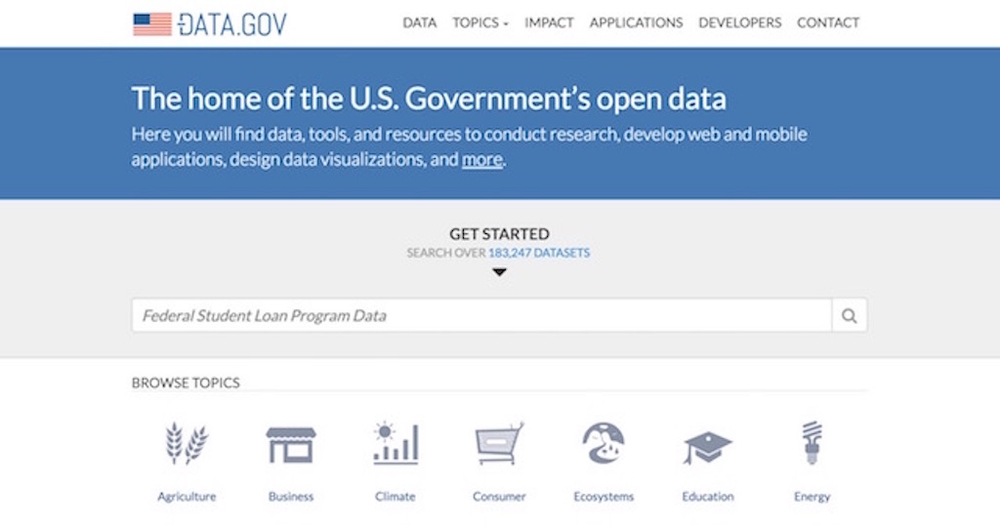
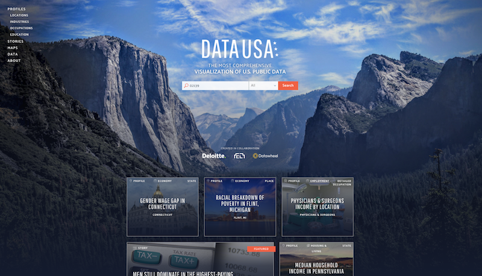
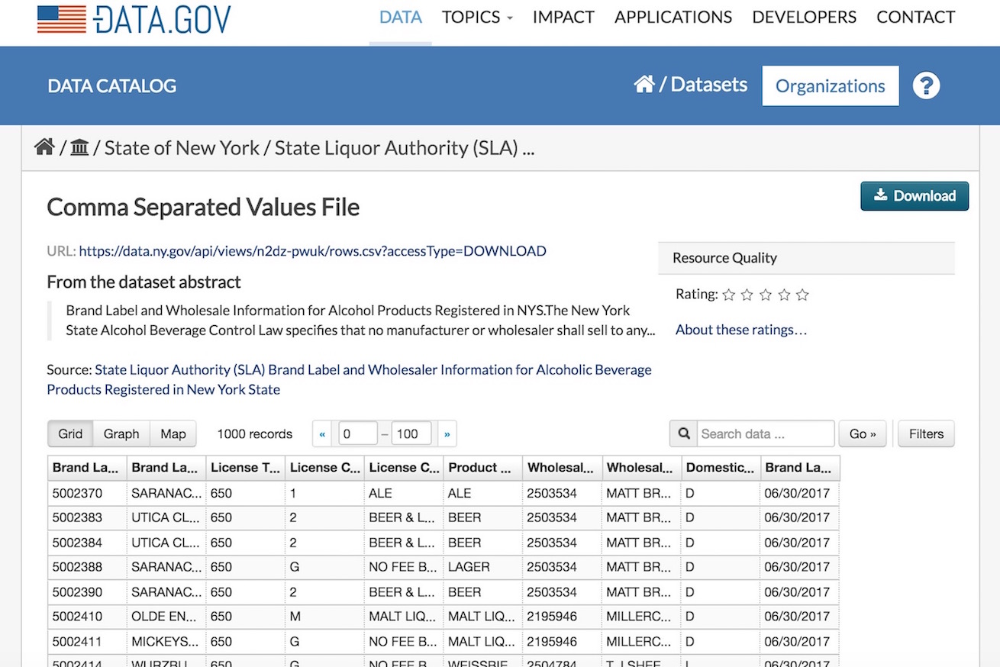
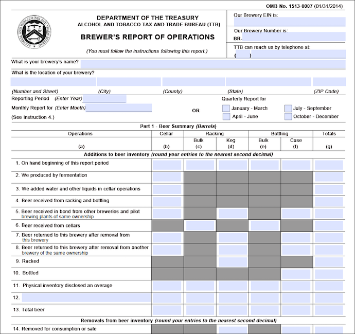
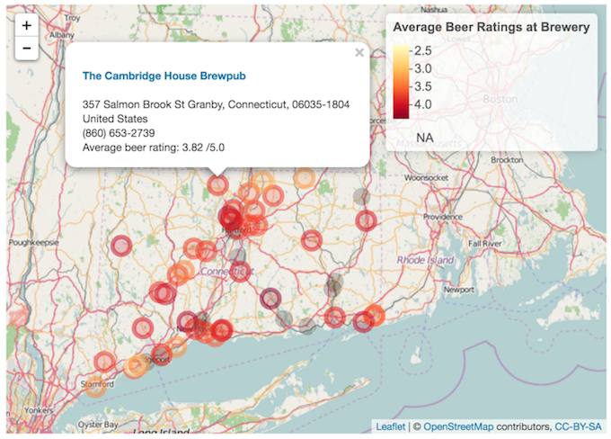

## Hi Cardiff!

- I'm Jasmine Dumas
    - Insurance **Data Scientist** and **useR** living in Connecticut, USA
    - M.S. Candidate in **Predictive Analytics** at DePaul University
    - Beginning Home brewer!
- Slides and Materials available at: [jasdumas/talks/caRdiff-uk-open-gov-beer](https://github.com/jasdumas/talks/tree/master/caRdiff-uk-open-gov-beer)

</img>


## What this presentation is about (and not about)

- I'm going to talk about the state of **open government data** in relation to **beer**
    - difficulties in finding and exploring analysis-ready data in a never ending *sea* of data
- This is **not** about **"drunk politics"** 
    - not about regulations, hacking, or scandals regarding data

</img>  **not** </img>


## The search for datasets

- Finding **interesting** and **available** datasets is a concern for all those involved in data analysis
- Where to look?
    - [Google public data explorer](https://www.google.com/publicdata/directory)
    - [Github](https://github.com/jasdumas/awesome-public-datasets)
    - [kaggle data repository](https://www.kaggle.com/datasets)
    - Open Government Data Portals: [UK](https://data.gov.uk/), [Connecticut](https://data.ct.gov/), [SF](https://data.sfgov.org/), 
    - Machine Learning Repositories at Universities: [UCI](http://archive.ics.uci.edu/ml/)

</img>

    
## The search continues for analysis-ready datasets

- Many people say that [data wrangling (or cleaning) is ~70% of the data science process](http://www.nytimes.com/2014/08/18/technology/for-big-data-scientists-hurdle-to-insights-is-janitor-work.html?_r=0)
    - the desire for analysis-ready data is a high priority after addressing the business questions of a project and before the data wrangling step
- analysis-ready data also *needs* to include *some* type of documentation (data wiki's FTW)

</img>


## The U.S. Government Open Data Portal

The "clearinghouse" for open U.S. government data is located at [data.gov](https://www.data.gov/). It also contains tools, and resources to conduct research, develop web and mobile applications, design data visualizations.

</img>


## Example Application of the U.S. Government open data portal

- [datausa.io](http://datausa.io/): an online application developed by a team of data scientists at MIT Media Lab and Datawheel, backed by Deloitte is helping Americans visualize demographic and economic data using an open source platform

</img>


## Just because it's open doesn't mean it's accessible!


## Good examples of datasets

- "Good" datasets are "Good" if they can be read in to R with functions like: 
    - `read.csv`,   `read_csv`    or    `read.table` 
- "Great" datasets take minimal cleaning aside from manipulation and have interpretable data fields

</img>


## Bad examples of datasets 

- "Bad" datasets are "bad" if they are in inconsistent formats, have mixed columns, and cryptic data fields
- "Bad" = difficult for analysis

</img>


## The landscape of beer datasets

- There are limited amounts of datasets for beer analytics. Here are some examples:
    - **Datasets**: [Craft Beer Sample Data](http://www.craftbeeranalytics.com/beer-data.html), [SNAP-RateBeer*](https://snap.stanford.edu/data/web-RateBeer.html) - *which is provided to academic researchers only*
    - **API's**: [RateBeer](http://www.ratebeer.com/json/ratebeer-api-agreement.asp), [Untapped](https://untappd.com/api/docs), [The Beer Mapping Project](http://beermapping.com/api/), [BreweryDB](http://www.brewerydb.com/apps) | API's that are available have restrictions on usage or require a user account
    - **Data analysis projects of beer**: [yhat Beer Advocate Recommender](http://blog.yhat.com/posts/recommender-system-in-r.html), [Crowd-sourced Beer Distribution Map](http://www.seekabrew.com/distro/index.html)

<iframe src="http://beers.yhathq.com/" style="position: center;"></iframe>


## The reality and struggle of beer datasets

- ... are real!
- This can lead to:
    - frustration
    - losing interest and passion for the domain
    - choosing another dataset
    - abandoning the data analysis project
    - breaking Terms of Service (ToS) with web-scraping 
    
</img>
    

## Necessity breeds innovation

- I was inspired to become better at **finding datasets** and **web scraping** from the road-blocks of finding analysis-ready datasets!
- Here is a [tutorial](http://trendct.org/2016/03/18/tutorial-web-scraping-and-mapping-breweries-with-import-io-and-r/) I wrote to get meta data on brewery ratings in Connecticut from Beer Advocate using [Import.io](https://www.import.io/)

</img>


## Introducing `ttbbeer`

- An R data package of beer statistics from U.S. Department of the Treasury, Alcohol and Tobacco Tax and Trade Bureau (TTB)
    - **The plan**: liberate more beer statistics datasets from *open U.S. government data portals* to analysis-ready data frames for R and beyond
    - **The method**: **web-scraping** with `rvest` (the first dataset was copy/pasted to excel due to the limited R ecosystem of PDF parsing packages)
    - **The dream**: increase awareness of beer analytics and promote analysis-ready datasets from [data.gov](https://www.data.gov/)
    
- available on [CRAN](https://cran.r-project.org/web/packages/ttbbeer/index.html) and [Github](https://github.com/jasdumas/ttbbeer)


```{r, echo=FALSE}
library(ggplot2)
library(ttbbeer)
data("beermaterials")

ggplot(beermaterials, aes(x=Year, y=Malt_and_malt_products, color=Month)) +
     geom_line() +
     theme_minimal() +
     theme(axis.ticks = element_blank(), axis.text.x = element_blank()) +
     facet_grid(.~Month)

```

## Questions & Cheers!


<p> </img> + </img> </p>
