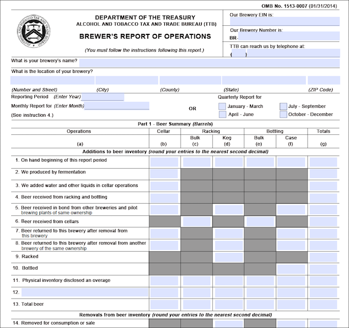

## Hi Cardiff!

- I'm Jasmine Dumas
    - Insurance *Data Scientist* and *useR* living in Connecticut, USA
- Slides and Materials available at: [jasdumas/talks/caRdiff-uk-open-gov-beer](https://github.com/jasdumas/talks/tree/master/caRdiff-uk-open-gov-beer)

</img>


## The search for datasets

- Finding *interesting* and *available* datasets is a concern for all those involved in data science.
- Where to look?
    - google
    - github
    - kaggle
    - open government data portals
    - machine learning repositories at Universities

</img>

    
## The search continues for analysis-ready datasets

- If cleaning data is 70% of the data science process than the desire for analysis-ready data (even at the basic csv format) is priority #1 after addressing the business questions.
- analysis-ready data also needs to include *some* type of documentation

</img>


## The U.S. Government open data portal

The "clearinghouse" for open U.S. government data is located at [data.gov](https://www.data.gov/). It also contains tools, and resources to conduct research, develop web and mobile applications, design data visualizations.

</img>


## Good examples of datasets

- "Good" datasets are "Good" if they can be read in to R with functions like: `read.csv`, `read.table` or even webscraped efficiently
- "Great" datasets take minimal cleaning aside from manipulation

```{r, echo=FALSE}
print(head(iris))
```


## Bad examples of datasts 

- "Bad" datasets are "bad" if they are in inconsistent formats, have mixed columns
- "Bad" difficult for analysis

</img>


## The landscape of beer datasets

- There are limited amounts of datasets for beer analytics and the API's that are availabe have restrictions on usage or require a user account
    - **datasets**: [http://www.craftbeeranalytics.com/beer-data.html](http://www.craftbeeranalytics.com/beer-data.html), [SNAP-RateBeer*](https://snap.stanford.edu/data/web-RateBeer.html) - *which is provided to academic researchers only*
    - **api's**: [RateBeer](http://www.ratebeer.com/json/ratebeer-api-agreement.asp), [Untapped](https://untappd.com/api/docs), [The Beer Mapping Project](http://beermapping.com/api/), [BreweryDB](http://www.brewerydb.com/apps)
    - **data analysis projects of beer**: [yhat BeerAdvocate Recommender](http://blog.yhat.com/posts/recommender-system-in-r.html)

<iframe src="http://beers.yhathq.com/" style="position: center;"></iframe>

## The reality and struggle of limited beer datasets

- ... are real and lead to:
    - frustration
    - losing interest and passion for the domain
    - choosing another dataset
    - abandoning the data analysis project
    - breaking Terms of Service (ToS) with web-scraping 

## The sparcity of beer data actaully inspired me become better at finding datasets and webscraping!

- Here is a [tutorial](http://trendct.org/2016/03/18/tutorial-web-scraping-and-mapping-breweries-with-import-io-and-r/) I wrote to get meta data from Beer Advocate using [Import.io](https://www.import.io/)

</img>

## `ttbbeer`

- An R data package of beer statistics from U.S. Department of the Treasury, Alcohol and Tobacco Tax and Trade Bureau (TTB)
    - The plan: liberate more beer statistics datasets from *open U.S. government data portals* to analysis-ready data frames for R and beyond
    - The method: **web-scraping** with `rvest` (the first dataset was copy/pasted to excel due to the limited R ecosystem of PDF parsing pacakges)
    - The dream: increase awareness of beer analytics and promote analysis-ready datasets from [data.gov](https://www.data.gov/)
    
- available on [CRAN](https://cran.r-project.org/web/packages/ttbbeer/index.html) and [Github](https://github.com/jasdumas/ttbbeer)


```{r}
library(ttbbeer)
data("beermaterials")
print(head(beermaterials))
```

## Questions & Cheers!


<p> </img> + </img> </p>
