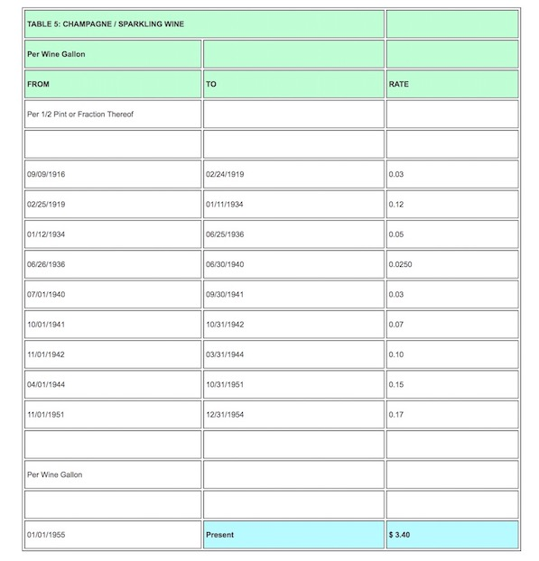
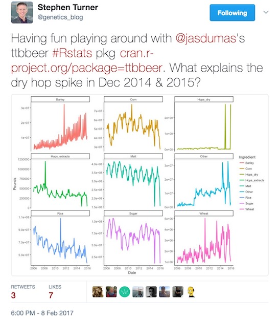

```{r setup, include=FALSE}
knitr::opts_chunk$set(echo = FALSE)
library(dplyr)
library(gganimate)
library(ggplot2)
library(ttbbeer)
library(tidyr)
library(plotly)
library(emo)
```

## Hi Boston!

<div class="column-left">
- I'm Jasmine Dumas
    - **Data Scientist** and **useR** living in Connecticut
    - Work at **Simple Finance** based in Portland, OR
    - Author of **`ttbbeer`** and **`shinyLP`**
- Slides and Materials available on GitHub: 
    - [jasdumas/talks/odsc-boston](https://github.com/jasdumas/talks/tree/master/odsc-boston)


</div>

<div class="column-right">
</img>

</div>

## Why should you care open government data?

<h1 style='color:#ffffff; background-color:#009fe1;'>To foster and improve data literacy & statistical comprehension within our community, Scientists and Engineers need to advocate for data that is provided in an consistent and accessible method suitable for analysis.</h1>

## What this presentation is about (and not about)

<div class="column-left">
- The state of **open government data** in relation to **beer analytics** and the difficulties in finding and exploring analysis-ready data in a never ending *sea* of data
- This is **not** about **"drunk politics"** or regulations, hacking, or scandals regarding data
</div>

<div class="column-center">

</div>


## 2017 has been an interesting time to be a Data Scientist...

<div class="column-center">

</div>

## What even is, beer analytics?

- The use of quantitative methods to: 
    - improve the production & quality of beer
    - measure customer preferences and predict seasonality
    - gather insights on industry performance

</img>

</img>

## Discovering analysis-ready beer datasets can be difficult

<div class="column-left">
- **Datasets**: 
    - [Craft Beer Data](https://www.kaggle.com/nickhould/craft-cans) `r emo::ji("free")`   
    - [SNAP-RateBeer](https://snap.stanford.edu/data/web-RateBeer.html) `r emo::ji("caution")` **Accessible to academic researchers only**
- **API's**: 
    - [RateBeer](http://www.ratebeer.com/json/ratebeer-api-agreement.asp) `r emo::ji("caution")` **Restrictions on usage**  
    - [Untapped](https://untappd.com/api/docs) `r emo::ji("caution")` **Restrictions on usage or require a user account**
    - [The Beer Mapping Project](http://beermapping.com/api/) `r emo::ji("free")` 
    - [BreweryDB](http://www.brewerydb.com/apps) `r emo::ji("dollar")` 
- **Beer projects**: 
    - [yhat Beer Advocate Recommender](http://blog.yhat.com/posts/recommender-system-in-r.html) 
    - [Crowd-sourced Beer Distribution Map](http://www.seekabrew.com/distro/index.html)

</div>

<div class="column-right">

</div>

## How to generally search for analysis-ready datasets

<div class="column-left">
- [Google public data explorer](https://www.google.com/publicdata/directory)
- [Github](https://github.com/jasdumas/awesome-public-datasets)
- [Kaggle data repository](https://www.kaggle.com/datasets)
- Machine Learning Repositories at Universities: [UCI](http://archive.ics.uci.edu/ml/)
- **Open Government Data Portals**: [Boston](https://data.boston.gov/), [Connecticut](https://data.ct.gov/), [SF](https://data.sfgov.org/), and many more
</div>

<div class="column-right">


</div>

## The U.S. Government Open Data Portal

The "clearinghouse" for open U.S. government data is located at [data.gov](https://www.data.gov/). It also contains tools & resources to conduct research, develop web and mobile applications, and design data visualizations.

</img>

## Examples of analysis-ready datasets

- Analysis-ready datasets can be obtained with *R* functions like: 
    - `read.csv()` or `read.table()` 
- "Great" analysis-ready datasets take minimal cleaning and have interpretable data fields
- Analysis-ready data also *needs* to include *some* type of documentation such as a data dictionary

</img>

## Examples of datasets that are not analysis-ready

- Datasets that have **inconsistent formats, mixed column types, and cryptic data fields** make it difficult for analysis (not tidy)

</img>

## Here is the point of all of this...

<h1 style='color:#ffffff; background-color:#009fe1;'>Just because it's open doesn't mean it's accessible!</h1>

## Necessity breeds innovation

- I was inspired to become better at **finding datasets** and **web scraping** from the road-blocks of finding analysis-ready datasets for projects about beer!

- Here is a [tutorial](http://trendct.org/2016/03/18/tutorial-web-scraping-and-mapping-breweries-with-import-io-and-r/) I wrote to get meta data on brewery ratings in Connecticut from Beer Advocate using [Import.io](https://www.import.io/) and processed the data with *R*.

</img>

## I developed a R package for beer statistics, called `ttbbeer`

<div class="column-left">
- This *R* data package provides data from the **U.S. Department of the Treasury, Alcohol and Tobacco Tax and Trade Bureau (TTB)**:
    - **one dataset** for materials used at U.S. breweries as listed in the Beer Monthly Statistical Releases
    - **eight datasets** for historical tax rates of distilled spirits, wine, beer, champagne, and tobacco 
- Available on [CRAN](https://cran.r-project.org/web/packages/ttbbeer/index.html) [](http://cran.rstudio.com/web/packages/ttbbeer/index.html) and [Github](https://github.com/jasdumas/ttbbeer)
</div>

<div class="column-right">

</div>

## How I developed the `ttbbeer` package

<div class="column-left">
- Hand transcribing from PDF documents to an *excel* workbook `r emo::ji("cry")`
    - Limited PDF parsing packages in R
- Web scraping using the *R* package [`rvest`](https://github.com/hadley/rvest) `r emo::ji("smile")`
</div>

<div class="column-right">

</div>

## Simple web scraping in R for historical tax rates

<div class="column-left">
- Specify a [html](https://www.ttb.gov/tax_audit/94a01_4.shtml) document 

- Select parts of a document using css selectors using the **inspect** feature on Chrome or [**SelectorGadget: point and click CSS selectors**](http://selectorgadget.com/)

- Extract the parts out to a object
</div>

<div class="column-right">

</img>

</div>


## Insights from the data in the wild



## Advocating for open data


## Wrapping things up

<div class="column-left">
- Analysis-ready beer data is difficult to find and rarely cost effective
- Open Government Data portals, such as [data.gov](data.gov) offer a good platform to share data for those looking for projects
- Data quality needs to be championed to ensure government agencies are providing accessible data
</div>

<div class="column-right">

</div>


## Questions & Discussion!


