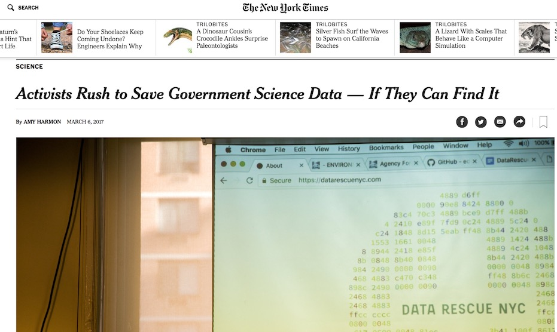
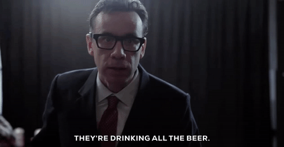
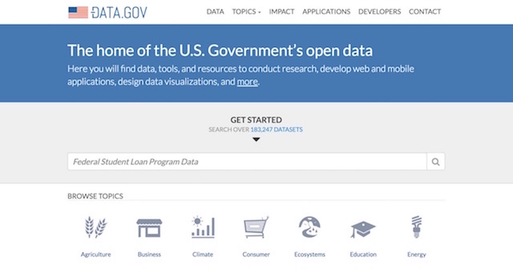
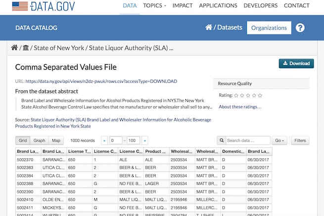
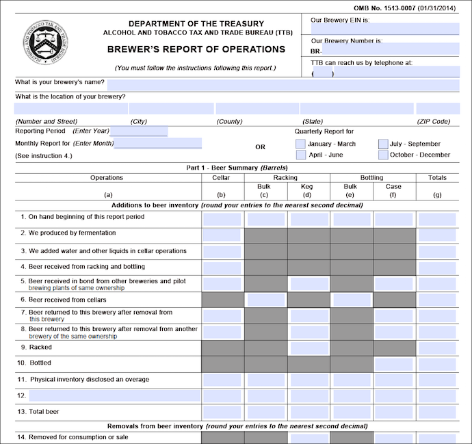
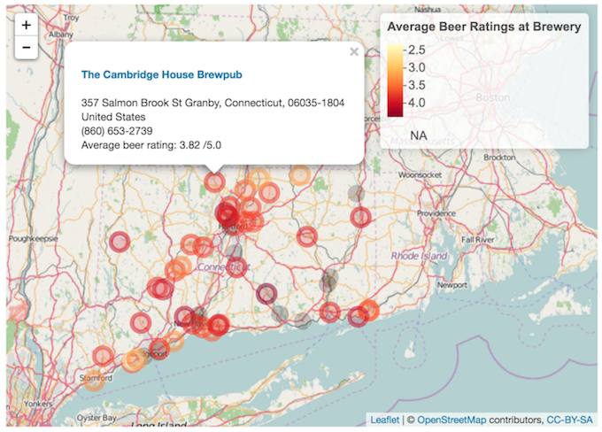
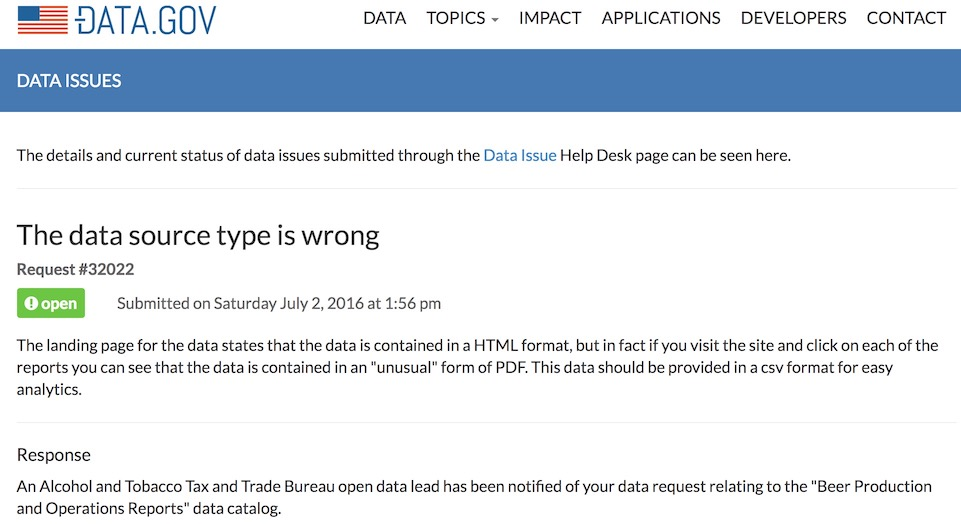

```{r setup, include=FALSE}
knitr::opts_chunk$set(echo = FALSE)
library(dplyr)
library(gganimate)
library(ggplot2)
library(ttbbeer)
library(tidyr)
```

## Hi Boston!

- I'm Jasmine Dumas
    - **Data Scientist** and **useR** living in Connecticut
    - Work at **Simple Finance** based in Portland, OR
    - Author of **`ttbbeer`** and **`shinyLP`**
- Slides and Materials available on GitHub: 
    - [jasdumas/talks/odsc-boston](https://github.com/jasdumas/talks/tree/master/odsc-boston)

</img>

</img>

## Why should you care open government data?

<h1 style='color:#ffffff; background-color:#009fe1;'>To foster and improve data literacy & statistical comprehension within our community, Scientists and Engineers need to advocate for data that is provided in an consistent and accessible method suitable for analysis.</h1>

## What this presentation is about (and not about)

- The state of **open government data** in relation to **beer analytics** and the difficulties in finding and exploring analysis-ready data in a never ending *sea* of data
- This is **not** about **"drunk politics"** or regulations, hacking, or scandals regarding data

</img>

## 2017 has been an interesting time to be a Data Scientist...



## What even is, beer analytics?

- The use of quantitative methods to: 
    - improve the production & quality of beer
    - measure customer preferences and predict seasonality
    - gather insights on industry performance

</img>

## Discovering analysis-ready beer datasets can be difficult

- **Datasets**: [Craft Beer Sample Data](http://www.craftbeeranalytics.com/beer-data.html), [SNAP-RateBeer*](https://snap.stanford.edu/data/web-RateBeer.html) | **Accessible to academic researchers only**
- **API's**: [RateBeer](http://www.ratebeer.com/json/ratebeer-api-agreement.asp), [Untapped](https://untappd.com/api/docs), [The Beer Mapping Project](http://beermapping.com/api/), [BreweryDB](http://www.brewerydb.com/apps) | **Restrictions on usage or require a user account**
- **Projects about beer**: [yhat Beer Advocate Recommender](http://blog.yhat.com/posts/recommender-system-in-r.html) and [Crowd-sourced Beer Distribution Map](http://www.seekabrew.com/distro/index.html)

</img>

## How to search for analysis-ready datasets in general

- [Google public data explorer](https://www.google.com/publicdata/directory)
- [Github](https://github.com/jasdumas/awesome-public-datasets)
- [Kaggle data repository](https://www.kaggle.com/datasets)
- Machine Learning Repositories at Universities: [UCI](http://archive.ics.uci.edu/ml/)
- **Open Government Data Portals**: [Boston](https://data.boston.gov/), [Connecticut](https://data.ct.gov/), [SF](https://data.sfgov.org/), and many more

</img>

## The U.S. Government Open Data Portal

The "clearinghouse" for open U.S. government data is located at [data.gov](https://www.data.gov/). It also contains tools & resources to conduct research, develop web and mobile applications, and design data visualizations.

</img>

## Examples of analysis-ready datasets

- Analysis-ready datasets can be obtained with *R* functions like: 
    - `read.csv()` or `read.table()` 
- "Great" analysis-ready datasets take minimal cleaning and have interpretable data fields
- Analysis-ready data also *needs* to include *some* type of documentation such as a data dictionary

</img>

## Examples of datasets that are not analysis-ready

- Datasets that have inconsistent formats, mixed column types, and cryptic data fields make it difficult for analysis

</img>

## Here is the point of all of this

<h1 style='color:#ffffff; background-color:#009fe1;'>Just because it's open doesn't mean it's accessible!</h1>

## Necessity breeds innovation

- I was inspired to become better at **finding datasets** and **web scraping** from the road-blocks of finding analysis-ready datasets for projects about beer!

- Here is a [tutorial](http://trendct.org/2016/03/18/tutorial-web-scraping-and-mapping-breweries-with-import-io-and-r/) I wrote to get meta data on brewery ratings in Connecticut from Beer Advocate using [Import.io](https://www.import.io/) and processed the data with *R*.

</img>

## I developed a R package for beer statistics, called `ttbbeer`

This R data package provides **one dataset** for materials used at U.S. breweries as listed in the Beer Monthly Statistical Releases, and **eight datasets** for historical tax rates of distilled spirits, wine, beer, champagne, and tobacco from the U.S. Department of the Treasury, Alcohol and Tobacco Tax and Trade Bureau (TTB)

Available on [CRAN](https://cran.r-project.org/web/packages/ttbbeer/index.html) and [Github](https://github.com/jasdumas/ttbbeer)


## How I developed the `ttbbeer` package

- Hand transcribing from PDF documents to an excel workbook 😭
- Web-scraping using the R package [`rvest`](https://github.com/hadley/rvest) 😀


## Insights from this data

```{r, echo=FALSE, message=FALSE, warning=FALSE}

data("beermaterials")

beermaterials$Month<- factor( beermaterials$Month, levels = unique(beermaterials$Month) )

beermaterials %>% 
  gather(key = materials, value = pounds, -c(Month, Year)) %>% 
ggplot(., aes(x=Year, y=pounds, color=materials)) +
     geom_line() +
     geom_point() +
     theme_bw() +
     theme(axis.ticks = element_blank(), axis.text.x = element_blank()) +
     facet_wrap(~ Month, nrow = 1)
```


## Advocating for open data



## Questions & Discussion!


