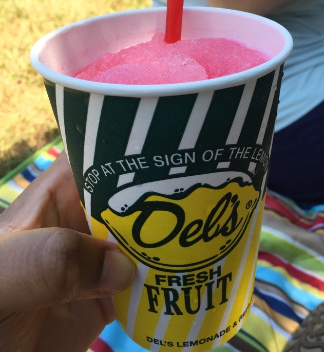

# rhodyrstats-R-user-group

A talk presented to the **University of Rhode Island (URI) Coastal Institute and [RhodyRstats R User Group](http://rhodyrstats.org/)**, A Data Science and R Study Group for Rhode Island on **Thursday, March 30th, 2017** 

_____

## Links

* **event link**: https://ci.uri.edu/2017/02/15/adventures-in-crafting-a-data-science-career/

* **event sign-up link**: https://www.eventbrite.com/e/seminar-with-jasmine-dumas-adventures-in-crafting-a-data-science-career-tickets-32269411679

* **facebook event link**: https://www.facebook.com/events/1350033715054165/

* **slides**: [HTML format](https://htmlpreview.github.io/?https://github.com/jasdumas/talks/blob/master/rhodyrstats-R-user-group/rhodyrstats-r-user-group-slides.html), [rpubs format](http://rpubs.com/jasdumas/uri-talk), [other format]()
