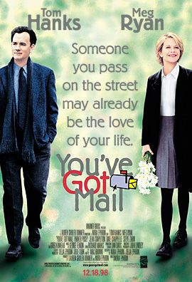
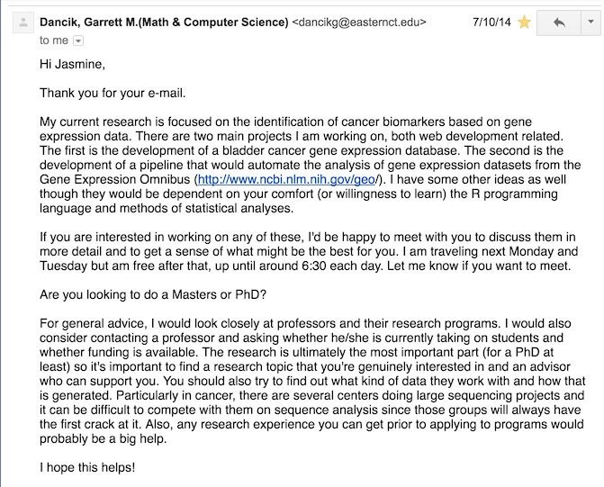
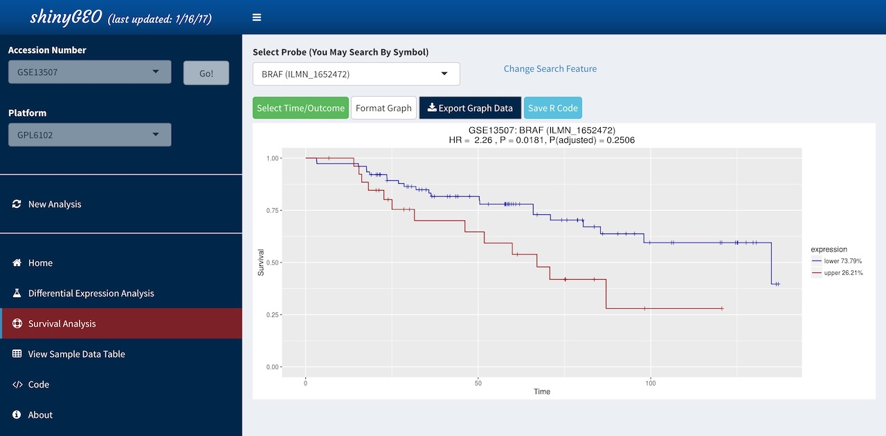
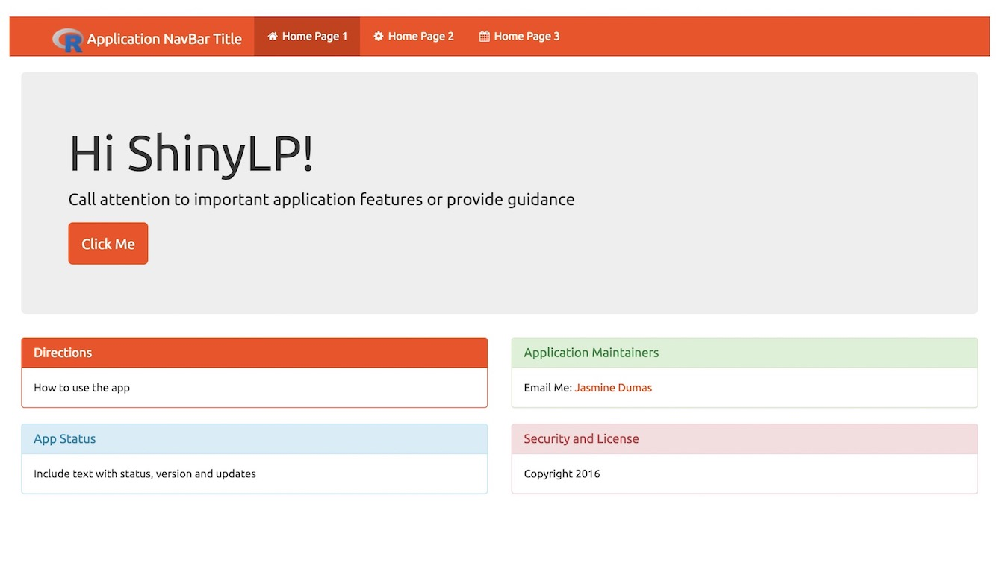

```{r setup, include=FALSE}
knitr::opts_chunk$set(echo = FALSE)
library(dplyr)
```

## Hi Narragansett!
- I'm Jasmine Dumas
    - **Data Scientist** and **useR** living in Connecticut
    - Work at **Simple Finance** based in Portland, OR
    - Author of **`ttbbeer`** and **`shinyLP`**
- Slides and Materials available on GitHub: 
    - [jasdumas/talks/rhodyrstats-R-user-group](https://github.com/jasdumas/talks/tree/master/rhodyrstats-R-user-group)

</img>

</img>

## More about my background in Biomedical Engineering

- Bachelor of Science in Biomedical Engineering from the University of Hartford
    - Lot's of Calculus but no Statistics courses!
- I participated in a few of research projects (one was published in the [CT Medical Journal](https://www.ncbi.nlm.nih.gov/pubmed/24156174))
- I was particularly found of computational approaches to solving engineering problems with regards to medical devices
    - Robotics
    - Aerospace
    - Computer-Aided Design
  
- **My Engineering Path**: Manufacturing Engineer ➡️ R&D Intern ➡️️ R&D Engineering Technician ➡️(...)➡️️️Data Scientist

## I learned about data science from the internet

</img>

## The classic data science diagram from Drew Conway:


## A updated (albeit oppinated) data science diagram from Mikhail Popov:

<blockquote class="twitter-tweet" data-lang="en"><p lang="en" dir="ltr">I&#39;m so tired of all the hilariously wrong data science venn diagrams so I made what I think will be definitive one. <a href="https://t.co/ELcPZi6atJ">pic.twitter.com/ELcPZi6atJ</a></p>&mdash; Mikhail Popov (@bearloga) <a href="https://twitter.com/bearloga/status/837756738690437121">March 3, 2017</a></blockquote>
<script async src="https://platform.twitter.com/widgets.js" charset="utf-8"></script>

## ["A rose by any other name would smell as sweet"](https://en.wikipedia.org/wiki/A_rose_by_any_other_name_would_smell_as_sweet)

- Aside from the buzzword of "Data Science" and the *sought after title* "Data Scientist" people have been involved in this type of work under several different names:
    - Data Mining
    - Datalogy
    - Knowledge Discovery
    - Data Analytics
    - Business Analytics
    - Predictive Analytics
    - Machine Learning
    - Informatics
    - Applied Statistics 
    - Quantitative Analyst
    - more? ...

## Discovering resources can be a challenge

- With many types of resources and approaches available, the decision on *what* to learn and *who* to learn it from can be overwhelming given the lack of consensus in curriculum.
    - 🎓 Graduate/Undergraduate coursework
    - 🆓 Open source coursework
    - 👾 Massively open online coursework (MOOCs)
    - 🔩 Project experience
    - 🏕 Bootcamps
    - 💼 Job experience 

</img>

## Dipping my toe in the water...

- Before enrolling in an **expensive** graduate school program, I wanted to gain some experience by combining MOOCs and project experience. 
- Some considerations I had when selecting my data science curriculum:
    - low cost or free
    - reputable instructors
    - interactive platform
    - diverse programming approaches
    - applied projects for a portfolio
    
</img>

## Cold emailing does work!

- Have you ever wanted advice but didn't know who to contact?
- Email someone in the field that you are interested in and ask about the path they took and what research they are engaged in!
- Tip on getting a response back: **Make it personal!**
    - I specifically emailed about advice on applying the graduate school and collaborating on a open source research project.
    
    

    
## The response... 

```{r, echo=FALSE, message=FALSE, warning=FALSE}
library(lubridate)
first_email <- mdy("7/10/14")
pres_date = mdy("3/30/17")
pres_date - first_email
```



## My first exposure to R programming was through Shiny

- Shiny is a web application framework for R and is quite different from R, syntactically
    - In 2014, shiny also did not have all of the features it has today
- Some of the usual R programming headaches did come up such as `stringsAsFactors = FALSE` 
- It was a mixture of learning about Bioinformatics, gene expression data, bioconductor, and *designing a data product for a non-technical user*.
    - tl;dr: Gene expression data is not like the `iris` dataset
    
## Sometimes unpaid volunteer work does pays off...

- [Google Summer of Code](https://summerofcode.withgoogle.com/) is a global program for undergraduates and graduate students to get funding from **Google** to work on an open source project for the Summer!
- What it provides:
    - $5500.00
    - Opportunity to gain more programming skills
    - Interface with the open source community
    - [Archival hosting](https://www.google-melange.com/archive/gsoc/2015/orgs/rproject/projects/jasdumas.html) of your abstract and code
    - Nobody talks about this heavily, but it does get you a *lifetime referral* for positions at Google!

## Some of the results from participating in the Google Summer of Code:

- A first author publication in the [*Bioinformatics Journal*](https://academic.oup.com/bioinformatics/article-abstract/32/23/3679/2525634/shinyGEO-a-web-based-application-for-analyzing)!

- An web application (currently being refactor to submit to [**rOpenSci**](https://ropensci.org/))


## How to make a connection to the R community

- ✅ Develop or contribute to packages (`ttbbeer`, `shinyGEO`)
- ✅ Answer (or ask for help) pleas for help on Twitter, through the [#rstats](https://twitter.com/hashtag/rstats?src=hash)
- ✅ Complete interesting analysis projects ([Web scraping and mapping breweries with import.io and R](https://trendct.org/2016/03/18/tutorial-web-scraping-and-mapping-breweries-with-import-io-and-r/))
- ✅ Start a podcast ([RTalk](https://itunes.apple.com/us/podcast/r-talk/id1030819337?mt=2))
- ✅ Start a blog ([jasdumas.github.io](https://jasdumas.github.io/))
- ✅ Put your code on GitHub ([github.com/jasdumas](https://github.com/jasdumas))
- ✅ Attend conferences ([useR!](https://user2017.brussels/))
- ✅ Volunteer to review code/papers ([Mapping useRs](http://forwards.github.io/blog/2017/01/13/mapping-users/))
- ✅ Volunteer in community initiatives  ([R-Ladies](http://rladies.org/), [Forwards](http://forwards.github.io/), [RWeekly](https://rweekly.org/))

## Applying for jobs that utilize R

- When searching for a Data Science Role, I look for: 
    - Language agnostic (R, Python or SQL focus)
    - Job description (detailed and inclusive language)
    - Opportunities for advancement (transparency and organization)
    - Professional development (provide funding for conferences or courses)
    - Diverse teams (experiences and backgrounds)
    
- It's also a humbling experience to ask for help via twitter:

<blockquote class="twitter-tweet" data-lang="en"><p lang="en" dir="ltr">Does anyone want to hire me to spice up their data with science using <a href="https://twitter.com/hashtag/rstats?src=hash">#rstats</a>? <br><br>I&#39;m looking for a job! 😬</p>&mdash; Jasmine Dumas (@jasdumas) <a href="https://twitter.com/jasdumas/status/713118293515759616">March 24, 2016</a></blockquote>
<script async src="https://platform.twitter.com/widgets.js" charset="utf-8"></script>

## Every path is unique...

**tl;dr: I love learning in a structured setting but I can learn best from doing applied data science in the workplace.**

- 🎓 Began a intro grad school course in programming at DePaul University
- 🌞 Google Summer of Code 2015 Program
- ⏳Part-time Intern in a Bioinformatics Laboratory at UCONN & Data Science Group for The Hartford Insurance Company
- 💻Full-time Associate Data Scientist in a Data Science Group for The Hartford Insurance Company
- 🎓 Began intro grad school courses in Computer Science at Johns Hopkins EP and then left
- 💻**Full-time Data Scientist 2 at Simple!**


## Starting from the bottom is ok!

- I started with basic tutorials and then moved on to more advanced projects where I was webscraping my own data, conceiving hypotheses, and developing dashboards & reports.


## Advice that I wish I heard 2.5 years ago:

<h2 style='color:#ffffff; background-color:#009fe1;'>Ultimately, technical skills, passion, and curiosity are key attributes of a productive data scientist and essential to collaborating with others!</h2>

## Alright, on to the fun stuff ... R:

<h2 style='color:#ffffff; background-color:#009fe1;'>R packages are a great way to combine code & documentation to share with others</h2>

## Accessing beer statistics with `ttbbeer`

- An R data package of beer statistics from U.S. Department of the Treasury, Alcohol and Tobacco Tax and Trade Bureau (TTB)
    - available on [CRAN](https://cran.r-project.org/web/packages/ttbbeer/index.html) and [Github](https://github.com/jasdumas/ttbbeer)

```{r, echo=FALSE, message=FALSE, warning=FALSE}
library(ggplot2)
library(ttbbeer)
library(tidyr)
data("beermaterials")

beermaterials$Month<- factor( beermaterials$Month, levels = unique(beermaterials$Month) )

beermaterials %>% 
  gather(key = materials, value = pounds, -c(Month, Year)) %>% 
ggplot(., aes(x=Year, y=pounds, color=materials)) +
     geom_line() +
     geom_point() +
     theme_bw() +
     theme(axis.ticks = element_blank(), axis.text.x = element_blank()) +
     facet_wrap(~ Month, nrow = 2)

```


## Make landing pages for `shiny` apps with `shinyLP`

- Adds **even more Bootstrap** components to make landing home pages for Shiny 
    - available on [CRAN](https://cran.r-project.org/web/packages/shinyLP/index.html) and [Github](https://github.com/jasdumas/shinyLP)




## The End {.bigger}

- Questions & Discussion!


## Slide topics

1. intro to data science and how I discovered it
1. where i'm at now
    1. *`ttbbeer`
    2. `shinyLP`
2. how i got there
3. volunteering to collaborate on oss research
4. google summer of code
5. making a connection with the rstats community
6. documenting my path with technical writing
7. starting from the bottom (PT internships > FT Jr. DS position > Early career DS)
8. continuously volunteering for mentor ship and leadership roles in the rstats community


