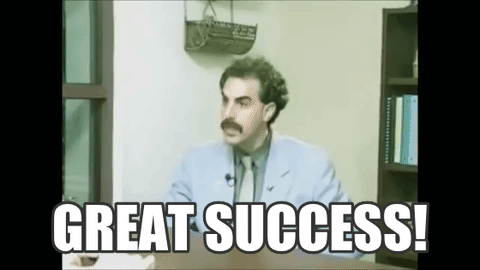
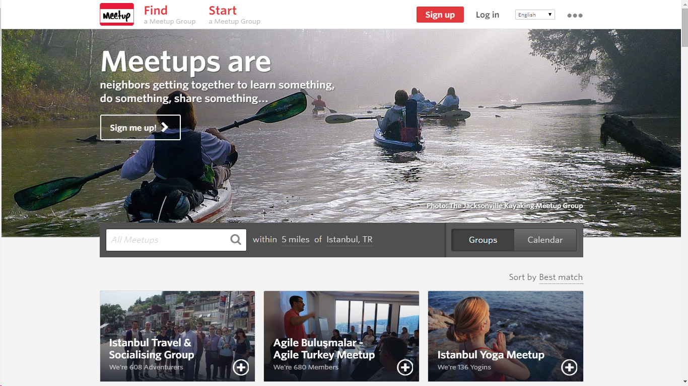

```{r setup, include=FALSE}
knitr::opts_chunk$set(echo = FALSE)
library(dplyr)
library(gganimate)
library(ggplot2)
library(ttbbeer)
library(tidyr)
```

## Hi Narragansett!
- I'm Jasmine Dumas
    - **Data Scientist** and **useR** living in Connecticut
    - Work at **Simple Finance** based in Portland, OR
    - Author of **`ttbbeer`** and **`shinyLP`**
- Slides and Materials available on GitHub: 
    - [jasdumas/talks/rhodyrstats-R-user-group](https://github.com/jasdumas/talks/tree/master/rhodyrstats-R-user-group)

</img>

</img>

## More about my background in Biomedical Engineering

- Bachelor of Science in Biomedical Engineering from the University of Hartford
    - Lots of Calculus but no Statistics courses!
- I participated in a few of research projects (one was published in the [CT Medical Journal](https://www.ncbi.nlm.nih.gov/pubmed/24156174))
- I was interested in computational approaches to solving engineering problems with regards to medical devices
    - Robotics
    - Aerospace
    - Computer-Aided Design
  
- **My Engineering Path**: 
    - Manufacturing Engineer ➡️ R&D Intern ➡️️ R&D Engineering Technician ➡️ (...) ➡️️ ️Data Scientist

## I learned about data science from the internet 

</img>

## The classic data science diagram from Drew Conway:


## A updated (albeit oppinated) data science diagram from Mikhail Popov:

<blockquote class="twitter-tweet" data-lang="en"><p lang="en" dir="ltr">I&#39;m so tired of all the hilariously wrong data science venn diagrams so I made what I think will be definitive one. <a href="https://t.co/ELcPZi6atJ">pic.twitter.com/ELcPZi6atJ</a></p>&mdash; Mikhail Popov (@bearloga) <a href="https://twitter.com/bearloga/status/837756738690437121">March 3, 2017</a></blockquote>
<script async src="https://platform.twitter.com/widgets.js" charset="utf-8"></script>

## ["A rose by any other name would smell as sweet"](https://en.wikipedia.org/wiki/A_rose_by_any_other_name_would_smell_as_sweet)

- Aside from the buzzword of "Data Science" and the *sought after title* "Data Scientist" people have been involved in this type of work under several different names:
    - Data Mining
    - Datalogy
    - Knowledge Discovery
    - Data Analytics
    - Business Analytics
    - Predictive Analytics
    - Machine Learning
    - Informatics
    - Applied Statistics 
    - Quantitative Analysis
    - more? ...

## Discovering resources can be a challenge

- With many types of resources and approaches available, the decision on *what* to learn and *who* to learn it from can be overwhelming given the lack of consensus in curriculum.
    - 🎓 Graduate/Undergraduate coursework
    - 🆓 Open source coursework
    - 👾 Massively open online coursework (MOOCs)
    - 🔩 Project experience
    - 🏕 Bootcamps
    - 💼 Job experience 

</img>

## Dipping my toe in the water...

- Before enrolling in an **expensive** graduate school program, I wanted to gain some experience by combining MOOCs and project experience. 
- Some considerations I had when selecting my data science curriculum:
    - low cost or free
    - reputable instructors
    - interactive platform
    - diverse programming approaches
    - applied projects for a portfolio
    
</img>

## Cold emailing does work!

- Have you ever wanted advice but didn't know who to contact?
- Email someone in the field that you are interested in and ask about the path they took and what research they are engaged in!
- Tip on getting a response back: **Make it personal!**
    - I specifically emailed about advice on applying the graduate school and collaborating on a open source research project.
    
    

## My first exposure to R programming was through Shiny

- Shiny is a web application framework for R and is quite different from R, syntactically
    - In 2014, shiny also did not have all of the features it has today
- Some of the usual R programming headaches did come up such as `stringsAsFactors = FALSE` 
- It was a mixture of learning about Bioinformatics, gene expression data, bioconductor, and *designing a data product for a non-technical user*
    - Gene expression data is not like the `iris` dataset
    
## Sometimes unpaid volunteer work does pays off...

- [Google Summer of Code](https://summerofcode.withgoogle.com/) is a global program for undergraduates and graduate students to get funding from **Google** to work on an open source project for the Summer!
- What it provides:
    - Opportunity to gain more programming skills
    - Interface with the open source community
    - [Archival hosting](https://www.google-melange.com/archive/gsoc/2015/orgs/rproject/projects/jasdumas.html) of your abstract and code
    - Nobody talks about this heavily, but it does get you a *lifetime referral* for positions at Google!

## Some of the results from participating in the Google Summer of Code

- A first author publication in the [*Bioinformatics Journal*](https://academic.oup.com/bioinformatics/article-abstract/32/23/3679/2525634/shinyGEO-a-web-based-application-for-analyzing)!

- An web application (currently being refactored to submit to [**rOpenSci**](https://ropensci.org/))


## How to make a connection to the R community

> - ✅ Develop or contribute to packages (`ttbbeer`, `shinyGEO`, `shinyLP`) 
> - ✅ Answer (or ask) for help on Twitter, through the [#rstats](https://twitter.com/hashtag/rstats?src=hash)
> - ✅ Complete interesting analysis projects ([Web scraping and mapping breweries with import.io and R](https://trendct.org/2016/03/18/tutorial-web-scraping-and-mapping-breweries-with-import-io-and-r/))
> - ✅ Start a podcast ([RTalk](https://itunes.apple.com/us/podcast/r-talk/id1030819337?mt=2))
> - ✅ Start a blog ([jasdumas.github.io](https://jasdumas.github.io/))
> - ✅ Put your code on GitHub ([github.com/jasdumas](https://github.com/jasdumas))
> - ✅ Attend conferences ([useR!](https://user2017.brussels/))
> - ✅ Volunteer to review code/papers ([Mapping useRs](http://forwards.github.io/blog/2017/01/13/mapping-users/))
> - ✅ Volunteer in community initiatives  ([R-Ladies](http://rladies.org/), [Forwards](http://forwards.github.io/), [RWeekly](https://rweekly.org/))

## Applying for jobs that utilize R

- When searching for a Data Science Role, I look for: 
    - Language agnostic (**R**, **Python** or **SQL** focus)
    - Job description (detailed and inclusive language)
    - Opportunities for advancement (transparency and organization)
    - Professional development (provide funding for conferences or courses)
    - Diverse teams (experiences and backgrounds)
    
- It's also a humbling experience to ask for help via twitter:

<blockquote class="twitter-tweet" data-lang="en"><p lang="en" dir="ltr">Does anyone want to hire me to spice up their data with science using <a href="https://twitter.com/hashtag/rstats?src=hash">#rstats</a>? <br><br>I&#39;m looking for a job! 😬</p>&mdash; Jasmine Dumas (@jasdumas) <a href="https://twitter.com/jasdumas/status/713118293515759616">March 24, 2016</a></blockquote>
<script async src="https://platform.twitter.com/widgets.js" charset="utf-8"></script>

## Every data science path is unique...

**tl;dr: I love learning in a structured setting but I can learn best from doing applied data science in the workplace.**

- 🎓 Began a intro grad school course in programming at DePaul University
- 🌞 Google Summer of Code 2015 Program
- ⏳Part-time Intern in a Bioinformatics Laboratory at UCONN & Data Science Group for The Hartford Insurance Company
- 💻Full-time Associate Data Scientist in a Data Science Group for The Hartford Insurance Company
- 🎓 Began intro grad school courses in Computer Science at Johns Hopkins EP and then left
- 💻**Full-time Data Scientist 2 at Simple!**


## Starting from the 'bottom' is ok! 

- I started with basic tutorials, books, & courses then moved on to advanced projects where I was webscraping my own data, conceiving hypotheses, and developing dashboards & reports.


## Advice that I wish I heard 2.5 years ago from myself: 

<h2 style='color:#ffffff; background-color:#009fe1;'>Ultimately, technical skills, passion, and curiosity are key attributes of a productive data scientist and essential to collaborating with others!</h2>

## Alright, on to the fun stuff ... R: 

<h2 style='color:#ffffff; background-color:#009fe1;'>R packages are a great way to combine code & documentation to share with others</h2>

## What even is, beer analytics?

- The use of quantitative methods to: 
    - improve the production & quality of beer
    - measure customer preferences and predict seasonality
    - gather insights on industry performance

</img>

## Finding beer datasets can be difficult

- **Datasets**: [Craft Beer Sample Data](http://www.craftbeeranalytics.com/beer-data.html), [SNAP-RateBeer*](https://snap.stanford.edu/data/web-RateBeer.html) - *which is provided to academic researchers only*
- **API's**: [RateBeer](http://www.ratebeer.com/json/ratebeer-api-agreement.asp), [Untapped](https://untappd.com/api/docs), [The Beer Mapping Project](http://beermapping.com/api/), [BreweryDB](http://www.brewerydb.com/apps) | API's that are available have restrictions on usage or require a user account
- **Data analysis projects of beer**: [yhat Beer Advocate Recommender](http://blog.yhat.com/posts/recommender-system-in-r.html), [Crowd-sourced Beer Distribution Map](http://www.seekabrew.com/distro/index.html)

</img>

## Necessity breeds innovation

- I was inspired to become better at **finding datasets** and **web scraping** from the road-blocks of finding analysis-ready datasets for beer-centric projects!
- Here is a [tutorial](http://trendct.org/2016/03/18/tutorial-web-scraping-and-mapping-breweries-with-import-io-and-r/) I wrote to get meta data on brewery ratings in Connecticut from Beer Advocate using [Import.io](https://www.import.io/)

</img>

## Accessing beer statistics with the `ttbbeer` package

- An R data package of beer statistics from U.S. Department of the Treasury, Alcohol and Tobacco Tax and Trade Bureau (TTB)
    - available on [CRAN](https://cran.r-project.org/web/packages/ttbbeer/index.html) and [Github](https://github.com/jasdumas/ttbbeer)

```{r, echo=FALSE, message=FALSE, warning=FALSE}

data("beermaterials")

#beermaterials$month_year <- paste0(beermaterials$Month, " ", beermaterials$Year)
#beermaterials$month_year <- mdy(beermaterials$month_year)
beermaterials$Month<- factor( beermaterials$Month, levels = unique(beermaterials$Month) )

beermaterials %>% 
  gather(key = materials, value = pounds, -c(Month, Year)) %>% 
ggplot(., aes(x=Year, y=pounds, color=materials)) +
     geom_line() +
     geom_point() +
     theme_bw() +
     theme(axis.ticks = element_blank(), axis.text.x = element_blank()) +
     facet_wrap(~ Month, nrow = 1)

```

## What even is, a landing page?

- Landing pages explain the web app's usage in a clear and concise manner - **Sets up users for success**!
- User success can be measured if the user can:
    - Use the application as intended, contact app maintainers for assistance, see examples, or sign up for a service or account

</img>

## An example of a landing home page


## Make landing pages for `shiny` apps with `shinyLP`

- Adds **even more Bootstrap** components to make landing home pages for Shiny 
    - available on [CRAN](https://cran.r-project.org/web/packages/shinyLP/index.html) and [Github](https://github.com/jasdumas/shinyLP)


## The End 

- Questions & Discussion!


