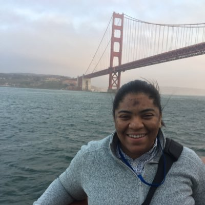

```{r setup, include=FALSE}
knitr::opts_chunk$set(echo = FALSE)
```

## Hi Narragansett!
- I'm Jasmine Dumas
    - **Data Scientist** and **useR** living in Connecticut
    - Work at **Simple Finance** based in Portland, OR
    - Author of **`ttbbeer`** and **`shinyLP`**
- Slides and Materials available on GitHub: 
    - [jasdumas/talks/rhodyrstats-R-user-group](https://github.com/jasdumas/talks/tree/master/rhodyrstats-R-user-group)

</img>


## I learned about data science from the internet

</img>

## ["A rose by any other name would smell as sweet"](https://en.wikipedia.org/wiki/A_rose_by_any_other_name_would_smell_as_sweet)

- Aside from the buzzword of "Data Science" and the *sought after title* "Data Scientist" people have been involved in this type of work under several different names:
    - Data Mining
    - Datalogy
    - Knowledge Discovery
    - Data Analytics
    - Business Analytics
    - Predictive Analytics
    - Machine Learning
    - Informatics
    - Applied Statistics 
    - more? ...

## Discovering resources can be a challenge

- With many types of resources and approaches available, the decision on *what* to learn and *who* to learn it from can be overwhelming given the lack of consensus in curriculum.
    - 🎓 Graduate/Undergraduate coursework
    - 🆓 Open source coursework
    - 👾 Massively open online coursework (MOOCs)
    - 🔩 Project experience
    - 🏕 Bootcamps
    - 💼 Job experience 

</img>

## Dipping my toe in the water...

- Before enrolling in an **expensive** graduate school program, I wanted to gain some experience by combining MOOCs and project experience. 
- Some considerations I had when selecting my data science curriculum:
    - low cost or free
    - reputable instructors
    - interactive platform
    - diverse programming approaches
    - applied projects for a portfolio
    
</img>

## Slide topics

1. intro to data science and how I discovered it
1. where i'm at now
    1. *`ttbbeer`
    2. `shinyLP`
2. how i got there
3. volunteering to collaborate on oss research
4. google summer of code
5. making a connection with the rstats community
6. documenting my path with technical writing
7. starting from the bottom (PT internships > FT Jr. DS position > Early career DS)
8. continuously volunteering for mentor ship and leadership roles in the rstats community


