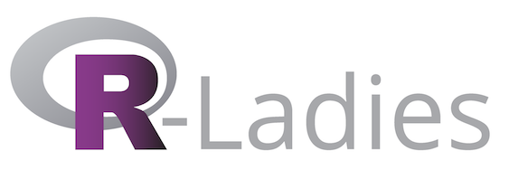
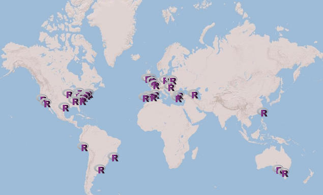

```{r setup, include=FALSE}
knitr::opts_chunk$set(
	echo = FALSE,
	message = FALSE,
	warning = FALSE
)
library(readr)
library(ggplot2)
library(dplyr)
```

## Intro to R-Ladies

- The mission of R-Ladies groups is to increase representation of women in the global R community through establishing local communities providing mentorship, collaborative learning & support. 
- Anyone with an interest in R programming is encouraged to participate. It doesn't matter if you never used R or if you are an R expert.



## R-Ladies has global reach



## Thanks

- Thanks to Manoilis E.I. Kaparakis (Director, Quantitative Analysis Center at Wesleyan University) for hosting us!

- Thanks to the **R Consortium** for sponsorship and the **global R-Ladies organization** for guidance and mentorship!


## Stats from the survey 

```{r, echo=FALSE}
survey <- read_csv("Kick-off for first R-Ladies Connecticut meetup.csv")

survey %>% group_by(`What is your affiliation?`) %>% 
           summarise(n = n()) %>% 
           mutate(percentage = (n / sum(n)) * 100) %>% 
           ggplot(., aes(x = `What is your affiliation?`, y = percentage)) +
              geom_bar(stat="identity", fill = "dodgerblue") +
              theme_minimal() +
              labs(title = "What is your affiliation?", 
                   x = "", y = "%")
```

## Stats from the survey

```{r, echo=FALSE}
survey %>% group_by(`Have you ever used R before?`) %>% 
           summarise(n = n()) %>% 
           mutate(percentage = (n / sum(n)) * 100) %>% 
           ggplot(., aes(x = `Have you ever used R before?`, y = percentage)) +
              geom_bar(stat="identity", fill = "purple") +
              theme_minimal() +
              labs(title = "Have you ever used R before?", 
                   x = "", y = "%")
```

## Stats from the survey

```{r, echo=FALSE}
mtg_type <- data.frame(type = unlist(strsplit(survey$`What is your preferred type of meeting?`, ";")))

mtg_type %>% group_by(type) %>% 
           summarise(n = n()) %>% 
           mutate(percentage = (n / sum(n)) * 100) %>% 
           ggplot(., aes(x = type, y = percentage)) +
              geom_bar(stat="identity", fill = "salmon") +
              theme_minimal() +
              labs(title = "What is your preferred type of meeting?", 
                   x = "", y = "%") +
              coord_flip(NULL)
```

## Stats from the survey

```{r, echo=FALSE}
topic_type <- data.frame(type = unlist(strsplit(survey$`What types of topics are you interested in?`, ";")))

topic_type %>% group_by(type) %>% 
           summarise(n = n()) %>% 
           mutate(percentage = (n / sum(n)) * 100) %>% 
           ggplot(., aes(x = type, y = percentage)) +
              geom_bar(stat="identity", fill = "green") +
              theme_minimal() +
              labs(title = "What types of topics are you interested in?", 
                   x = "", y = "%") +
              coord_flip(NULL)
```


## Call for volunteer organizers 

- Do you love getting involved and organizing events?
- Looking for opportunities to volunteer?
- Excited to make connections in the R community?

## Open discussion for future Meetup ideas! 

- Frequency
- Location
- Type
